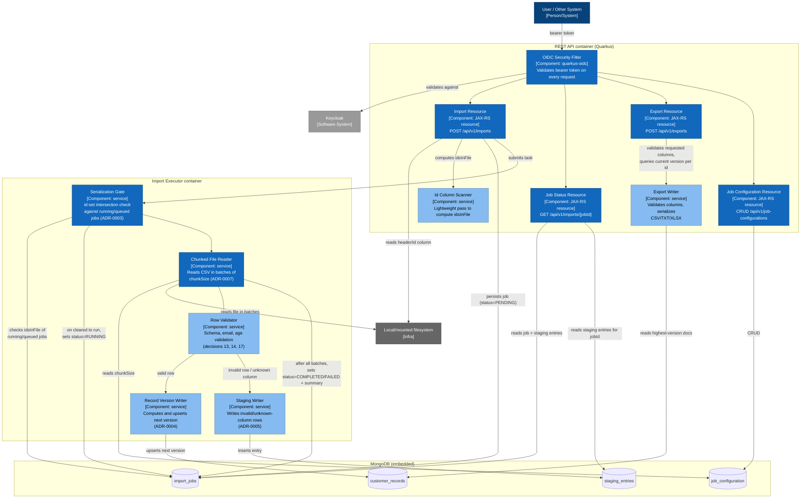

# C4 Component Diagram — REST API and Import Executor Containers

## Diagram

## Context

This is the C4 Level 3 (Component) diagram, decomposing the two application-owned containers from `docs/diagrams/c4/container.md` — REST API and Import Executor — into their internal components. It follows the import processing flow narrated step-by-step in `docs/openspec/changes/file-import-export/design.md`, section 3, and the export flow in section 4.

- **REST API components** map directly to the four capabilities in the proposal (import, job-status, export, job-configuration) plus the cross-cutting OIDC security filter (ADR-0006). The Import Resource performs only the lightweight `idsInFile` pass and job persistence before handing off to the executor — it does not perform row-level validation itself (design.md, section 3, steps 1-2).
- **Import Executor components** map to the five ordered steps in design.md section 3, steps 3-6: the Serialization Gate (ADR-0003) runs before any chunk processing; the Chunked File Reader re-reads `chunkSize` from `job_configuration` per job start (not cached indefinitely, per design.md section 3 step 4); the Row Validator enforces schema/email/age rules and routes outcomes to either the Record Version Writer (ADR-0004 merge policy) or the Staging Writer (ADR-0005).
- Database access is shown per-component to make traceable which component touches which collection, matching the data model in design.md section 1.

## Sources used

- `docs/openspec/changes/file-import-export/design.md` — sections 1 through 4 (data model, REST API surface, import flow, export flow).
- `docs/adr/ADR-0002-async-import-processing-mechanism.md`.
- `docs/adr/ADR-0003-per-job-id-intersection-serialization.md`.
- `docs/adr/ADR-0004-record-versioning-and-merge-policy.md`.
- `docs/adr/ADR-0005-single-generic-staging-collection.md`.
- `docs/adr/ADR-0006-oauth2-keycloak-dev-services.md`.
- `docs/adr/ADR-0007-job-configuration-value-shape.md`.
- `docs/requirements/functional-specification.md` — confirmed decisions 13, 14, 17 (validation rules).

## ADRs / decisions reflected

- **ADR-0003** — the Serialization Gate is drawn as the first component the executor invokes, strictly before the Chunked File Reader, matching design.md's explicit ordering ("before the task body runs, it acquires the ADR-0003 serialization gate").
- **ADR-0004** — the Record Version Writer is a distinct component from the Row Validator, isolating the merge-onto-history computation.
- **ADR-0005** — a single Staging Writer component serves both invalid-value and unknown-column outcomes, reflecting the single generic `staging_entries` collection (no separate quarantine components per error category).
- **ADR-0007** — the Chunked File Reader reads `chunkSize` from `job_configuration` at the start of each job, not from static configuration.
- **Confirmed decision 17** — the Row Validator treats an unrecognized header column as a whole-row failure (routed to the Staging Writer), not a partial success.

## Limitations / notes

- No diagram-validation tooling applies to this repository (no `src/`, no build files yet — see `docs/diagrams/c4/context.md`, Limitations). Mermaid syntax was validated by manual inspection (subgraph nesting, node/edge balance, no unescaped special characters in labels).
- Component names here (e.g., "Import Resource", "Serialization Gate") are architecture-level responsibilities derived from the design document's prose, not fixed Java class/interface names — exact class design is left to the Java Full-stack Engineer during implementation, per this agent's constraint against prescribing implementation code.
- The class-level diagram (concrete types, methods, relationships) is explicitly deferred: the project has no `src/` yet, so no class diagram is generated at this time.
