# C4 Component Diagram — REST API and Import Executor Containers

## Diagram

```mermaid
graph TB
    caller["User / Other System<br/>[Person/System]"]
    keycloak["Keycloak<br/>[Software System]"]
    filesystem["Local/mounted filesystem<br/>[Infra]"]

    subgraph api_container["REST API container (Quarkus)"]
        importRes["Import Resource<br/>[Component: JAX-RS resource]<br/>POST /api/v1/imports"]
        statusRes["Job Status Resource<br/>[Component: JAX-RS resource]<br/>GET /api/v1/imports/{jobId}"]
        exportRes["Export Resource<br/>[Component: JAX-RS resource]<br/>POST /api/v1/exports"]
        configRes["Job Configuration Resource<br/>[Component: JAX-RS resource]<br/>CRUD /api/v1/job-configurations"]
        oidcFilter["OIDC Security<br/>[Component: quarkus-oidc]<br/>@Authenticated on every resource;<br/>declarative, no custom filter class"]
        exportService["Export Service<br/>[Component: service]<br/>Orchestrates validate → query →<br/>project → serialize"]
        columnValidator["Export Column Validator<br/>[Component: service]"]
        rowProjector["Export Row Projector<br/>[Component: service]"]
        formatWriters["Format Writers<br/>[Component: service]<br/>CSV/TXT + XLSX (Apache POI)"]
    end

    subgraph exec_container["Import Processing (runs inside the REST API's own JVM, on an executor task)"]
        gate["Serialization Gate<br/>[Component: service]<br/>arrive() on request thread;<br/>awaitTurn() on executor task (ADR-0003)"]
        orchestrator["Import Processing Service<br/>[Component: service]<br/>Orchestrates the whole job: reads<br/>chunkSize, drives the reader/validator,<br/>calls repository/staging, sets job status"]
        chunkReader["Chunked File Reader<br/>[Component: stateless helper]<br/>Reads CSV in batches of<br/>chunkSize (ADR-0007)"]
        rowValidator["Row Validator<br/>[Component: stateless helper]<br/>Schema, email, age validation<br/>(decisions 13, 14, 17); returns<br/>an outcome, does not touch MongoDB"]
    end

    subgraph db["MongoDB"]
        customerRecords[("customer_records")]
        stagingEntries[("staging_entries")]
        importJobs[("import_jobs")]
        jobConfig[("job_configuration")]
    end

    caller -- "bearer token" --> oidcFilter
    oidcFilter -- "token validated against<br/>(OIDC discovery/JWKS)" --> keycloak
    oidcFilter --> importRes
    oidcFilter --> statusRes
    oidcFilter --> exportRes
    oidcFilter --> configRes

    importRes -- "reads header/id column<br/>(lightweight pass)" --> filesystem
    importRes -- "persists job (status=PENDING)" --> importJobs
    importRes -- "arrive(jobId, idsInFile)" --> gate
    importRes -- "submits task" --> orchestrator

    statusRes -- "reads job + staging entries" --> importJobs
    statusRes -- "reads staging entries for jobId" --> stagingEntries

    exportRes --> exportService
    exportService --> columnValidator
    exportService -- "queries current-version docs" --> customerRecords
    exportService --> rowProjector
    exportService --> formatWriters

    configRes -- "CRUD" --> jobConfig

    orchestrator -- "awaitTurn(jobId)" --> gate
    gate -- "checks idsInFile of every<br/>still-present earlier arrival" --> importJobs
    orchestrator -- "on cleared to run,<br/>sets status=RUNNING" --> importJobs
    orchestrator -- "reads chunkSize" --> jobConfig
    orchestrator --> chunkReader
    chunkReader -- "reads file in batches" --> filesystem
    orchestrator --> rowValidator
    orchestrator -- "valid row:<br/>insertNextVersion(row)" --> customerRecords
    orchestrator -- "invalid row / unknown column:<br/>insert staging entry" --> stagingEntries
    orchestrator -- "after all batches,<br/>sets status=COMPLETED/FAILED + summary" --> importJobs

    style importRes fill:#1168bd,stroke:#0b4884,color:#ffffff
    style statusRes fill:#1168bd,stroke:#0b4884,color:#ffffff
    style exportRes fill:#1168bd,stroke:#0b4884,color:#ffffff
    style configRes fill:#1168bd,stroke:#0b4884,color:#ffffff
    style oidcFilter fill:#1168bd,stroke:#0b4884,color:#ffffff
    style exportService fill:#1168bd,stroke:#0b4884,color:#ffffff
    style columnValidator fill:#85bbf0,stroke:#5d82a8,color:#000000
    style rowProjector fill:#85bbf0,stroke:#5d82a8,color:#000000
    style formatWriters fill:#85bbf0,stroke:#5d82a8,color:#000000
    style gate fill:#1168bd,stroke:#0b4884,color:#ffffff
    style orchestrator fill:#1168bd,stroke:#0b4884,color:#ffffff
    style chunkReader fill:#85bbf0,stroke:#5d82a8,color:#000000
    style rowValidator fill:#85bbf0,stroke:#5d82a8,color:#000000
    style keycloak fill:#999999,stroke:#666666,color:#ffffff
    style filesystem fill:#666666,stroke:#444444,color:#ffffff
    style caller fill:#08427b,stroke:#052e56,color:#ffffff
```

## Context

This is the C4 Level 3 (Component) diagram, decomposing the two application-owned containers from `docs/diagrams/c4/container.md` — REST API and Import Executor — into their internal components. It follows the import processing flow narrated step-by-step in `docs/openspec/changes/file-import-export/design.md`, section 3, and the export flow in section 4.

- **REST API components** map directly to the four capabilities in the proposal (import, job-status, export, job-configuration) plus the cross-cutting OIDC security (ADR-0006), applied declaratively via `@Authenticated` rather than a custom filter class. The Import Resource performs only the lightweight `idsInFile` pass, job persistence, and the ADR-0003 `arrive()` call before handing off to the executor — it does not perform row-level validation itself (design.md, section 3, steps 1-2). Export is orchestrated by the Export Service, which calls the Column Validator, queries `customer_records`, and delegates to the Row Projector and Format Writers in sequence — it is not a single monolithic "Export Writer" component.
- **Import Processing components** map to the ordered steps in design.md section 3, steps 3-6, all orchestrated by a single "Import Processing Service" component: it calls `awaitTurn()` on the Serialization Gate (ADR-0003) before any chunk processing, reads `chunkSize` from `job_configuration` per job start, drives the Chunked File Reader and Row Validator (both stateless helpers with no MongoDB access of their own), and — based on the validator's outcome — calls `customer_records` directly (merge-on-insert, ADR-0004) or `staging_entries` directly (ADR-0005). It also sets the job's `RUNNING`/`COMPLETED`/`FAILED` status. This runs inside the same JVM as the REST API, on an executor task — it is not a separate "Import Executor container" in the C4 sense (see `docs/diagrams/c4/container.md`'s note on this).
- Database access is shown per-component to make traceable which component touches which collection, matching the data model in design.md section 1.

## Sources used

- `docs/openspec/changes/file-import-export/design.md` — sections 1 through 4 (data model, REST API surface, import flow, export flow).
- `docs/adr/ADR-0002-async-import-processing-mechanism.md`.
- `docs/adr/ADR-0003-per-job-id-intersection-serialization.md`.
- `docs/adr/ADR-0004-record-versioning-and-merge-policy.md`.
- `docs/adr/ADR-0005-single-generic-staging-collection.md`.
- `docs/adr/ADR-0006-oauth2-keycloak-dev-services.md`.
- `docs/adr/ADR-0007-job-configuration-value-shape.md`.
- `docs/requirements/functional-specification.md` — confirmed decisions 13, 14, 17 (validation rules).

## ADRs / decisions reflected

- **ADR-0003** — the Serialization Gate exposes two calls, `arrive()` (called by the Import Resource, on the request thread, fixing arrival order) and `awaitTurn()` (called by the Import Processing Service, inside the executor task, where blocking actually happens) — matching `JobIntersectionGate`'s real two-phase design, not a single "check before the reader runs" step.
- **ADR-0004** — the merge-onto-history computation happens inside `customer_records` access itself (`CustomerRecordRepository.insertNextVersion`, which reads the current version and merges before inserting), invoked by the Import Processing Service after a valid outcome — not by a separate "Record Version Writer" component.
- **ADR-0005** — both invalid-value and unknown-column outcomes converge on the same `staging_entries` insert with the same field shape, issued directly by the Import Processing Service after a `Failure` outcome — not by a separate "Staging Writer" component.
- **ADR-0007** — the Import Processing Service reads `chunkSize` from `job_configuration` at the start of each job, not from static configuration, then drives the Chunked File Reader with that value.
- **Confirmed decision 17** — the Row Validator treats an unrecognized header column as a whole-row failure, returned as part of its outcome; the Import Processing Service is what routes that outcome to `staging_entries`.

## Limitations / notes

- No diagram-validation tooling applies to this repository (see `docs/diagrams/c4/context.md`, Limitations). Mermaid syntax was validated by manual inspection (subgraph nesting, node/edge balance, no unescaped special characters in labels).
- Component names here (e.g., "Import Resource", "Serialization Gate") are architecture-level responsibilities, but by this revision they have been re-validated against the completed implementation and now map onto real classes: Import Processing Service → `ImportProcessingService`; Chunked File Reader → `CsvFileReader`; Row Validator → `ImportRowValidator`; Serialization Gate → `JobIntersectionGate`; Export Service/Column Validator/Row Projector/Format Writers → `ExportService`/`ExportColumnValidator`/`ExportRowProjector`/`DelimitedTextExportWriter`+`XlsxExportWriter`.
- The class-level diagram (concrete types, methods, relationships) was deferred when this document was originally authored, before `src/` existed. The implementation is now complete; a class-level diagram could be generated from it if still useful.
