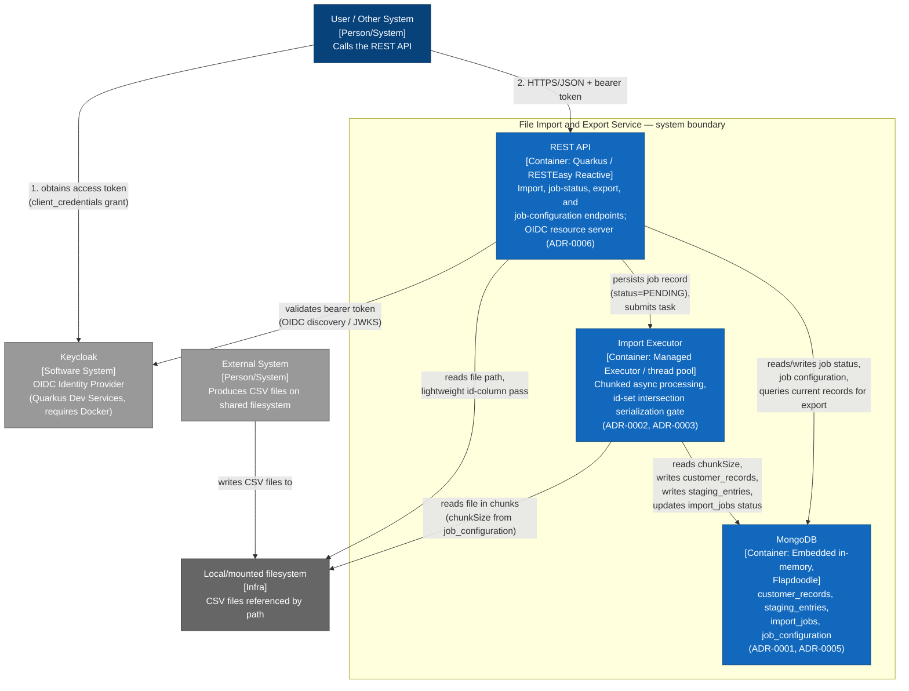

# C4 Container Diagram — File Import and Export Service

## Diagram

## Context

This is the C4 Level 2 (Container) diagram, decomposing the single "File Import and Export Service" box from `docs/diagrams/c4/context.md` into its three internal containers plus the filesystem it depends on. It reflects the single-process, single-deployment-unit shape described in the OpenSpec proposal ("they share one codebase, one build, one deployment unit").

- **REST API** — the Quarkus application's HTTP surface: import submission, job-status query, export, and job-configuration CRUD (`docs/openspec/changes/file-import-export/design.md`, section 2). It is also the OIDC resource server that validates every bearer token (ADR-0006).
- **Import Executor** — the dedicated managed executor/thread pool (ADR-0002) that performs chunked background processing and enforces the id-set intersection serialization gate before a job starts (ADR-0003). It is drawn as a separate container (not folded into the API) because it has a distinct runtime responsibility and lifecycle (in-process background work vs. request/response), even though both run inside the same deployable artifact/JVM.
- **MongoDB (embedded)** — the Flapdoodle in-memory MongoDB instance holding all four collections from the data model (ADR-0001, ADR-0005, ADR-0007): `customer_records`, `staging_entries`, `import_jobs`, `job_configuration`.
- **Local/mounted filesystem** — not a container of the service itself, but an infrastructure dependency both the API (initial id-column pass) and the Executor (chunked reads) access directly, per confirmed decision 8 (path-reference-only import).

## Sources used

- `docs/openspec/changes/file-import-export/design.md` — sections 1 (data model), 2 (REST API surface), 3 (import processing flow), 6 (concurrency model summary).
- `docs/adr/ADR-0001-mongodb-embedded-document-per-version-storage.md`.
- `docs/adr/ADR-0002-async-import-processing-mechanism.md`.
- `docs/adr/ADR-0003-per-job-id-intersection-serialization.md`.
- `docs/adr/ADR-0005-single-generic-staging-collection.md`.
- `docs/adr/ADR-0006-oauth2-keycloak-dev-services.md`.
- `AGENTS.md` — tech stack (Java 25, Gradle, Quarkus, embedded MongoDB).

## ADRs / decisions reflected

- **ADR-0001** — MongoDB is embedded (Flapdoodle), not an external database container; no separate DB server/network hop is modeled.
- **ADR-0002** — the executor is process-local (managed executor / thread pool), not a message broker or external queue; explicitly no Kafka/AMQP container exists.
- **ADR-0003** — the executor owns the id-set intersection gate; this is why job dispatch is drawn as API → Executor (submit) rather than API writing directly to `customer_records`.
- **ADR-0006** — Keycloak remains external; the API container is the only place OIDC validation happens (no separate auth container inside the boundary).

## Limitations / notes

- No diagram-validation tooling applies to this repository (see `docs/diagrams/c4/context.md`, Limitations). Mermaid syntax was validated by manual inspection. This diagram predates the completed implementation and has not been re-validated against it — in particular, it does not yet show the Mongo Express dev-only container (`src/main/java/com/planet/importexport/devtools/MongoExpressDevService.java`) or that MongoDB runs as a real Dev Services container (not Flapdoodle) under `%dev`.
- The Import Executor and REST API run inside the same JVM/deployment unit (per the proposal's "one deployment unit" framing); they are still shown as separate containers because C4 containers represent distinct runtime/responsibility boundaries, not necessarily separate deployables. This is a documentation choice, not an architectural claim of separate processes.
- Component-level detail (e.g., specific classes/services inside the REST API or Executor) belongs to `docs/diagrams/c4/component.md`.
