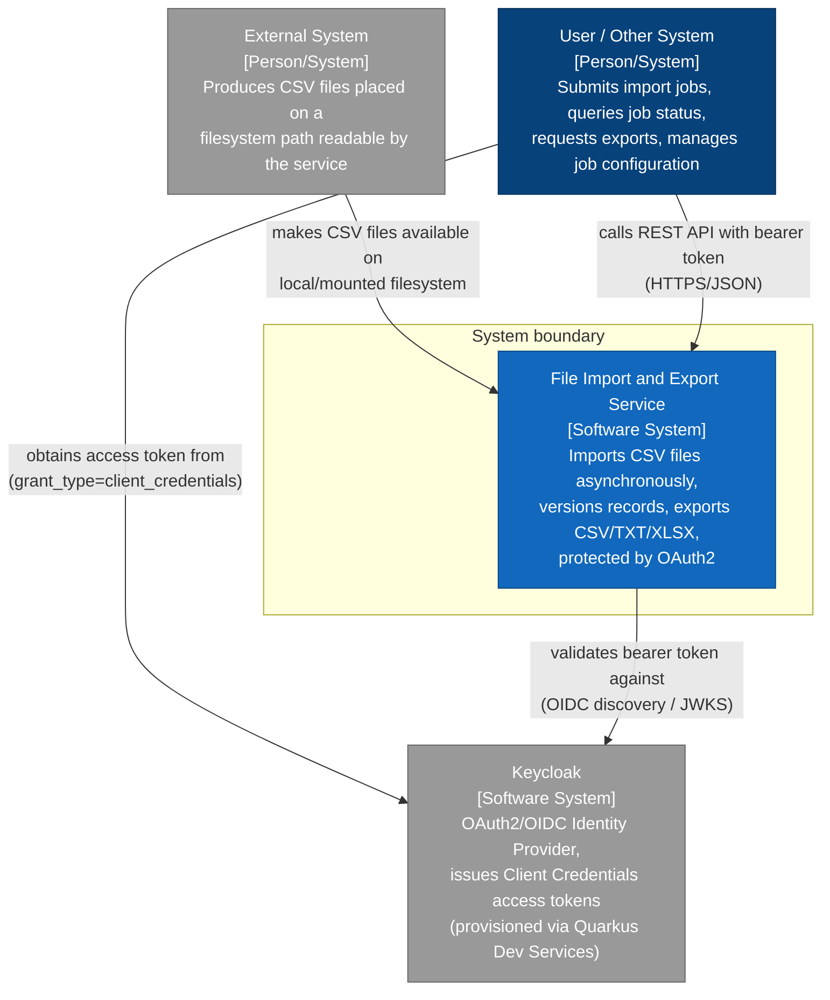

# C4 Context Diagram — File Import and Export Service

## Diagram

## Context

This is the C4 Level 1 (System Context) diagram for the File Import and Export Service, a greenfield backend exercise (no pre-existing systems, per Context Mapping in `docs/requirements/functional-specification.md`, section 4). It shows the service as a single black box and its three external actors:

- **External System** — the producer of CSV files. Per confirmed decision 8, files are never uploaded or fetched remotely; they must already exist on a local/mounted filesystem path that the service reads directly.
- **User / Other System** — the caller of the REST API: submits import jobs, polls job status, requests exports, and manages job configuration (chunk size, etc.). The functional specification treats "users" and "other systems" as the same simulated external role (Context Mapping, Outbound integrations).
- **Keycloak** — the OAuth2/OIDC Identity Provider. It is drawn as a separate external system (not a container of the service) because token issuance is delegated entirely to Keycloak's own `/realms/{realm}/protocol/openid-connect/token` endpoint; the service itself only validates bearer tokens (ADR-0006). Keycloak is provisioned via Quarkus Dev Services for local/dev/test runs, which is why Docker becomes a required external dependency for authentication only — not for storage.

## Sources used

- `docs/requirements/functional-specification.md` — Problem Framing (Desired state), Context Mapping (Integrations, External dependencies).
- `docs/openspec/changes/file-import-export/proposal.md` — capability list and impact.
- `docs/openspec/changes/file-import-export/design.md`, section 5 (Authentication integration).
- `docs/adr/ADR-0006-oauth2-keycloak-dev-services.md` — Keycloak as a separate IdP, Dev-Services provisioning, Docker dependency.

## ADRs / decisions reflected

- **ADR-0006** — Keycloak is modeled as an external system, not a service-owned component; the service never issues tokens itself.
- **Confirmed decision 8** (functional specification) — import is filesystem-path based, no upload/remote-fetch actor is modeled.
- **Confirmed decision 12** — OAuth2 Client Credentials is mandatory for every API interaction shown from the caller.

## Limitations / notes

- No diagram-validation tooling (e.g., `mvn validate`) applies to this repository: it is a Gradle/Quarkus project and, per `AGENTS.md`, "the Gradle/Quarkus skeleton has not been scaffolded yet" — there is no `build.gradle`, `pom.xml`, or `src/` yet. Mermaid syntax was validated by manual inspection only (balanced brackets, valid `graph TB` node/edge syntax, no reserved-character conflicts).
- This diagram intentionally omits internal containers (API, executor, MongoDB) — those belong to the Container-level diagram (`docs/diagrams/c4/container.md`).
