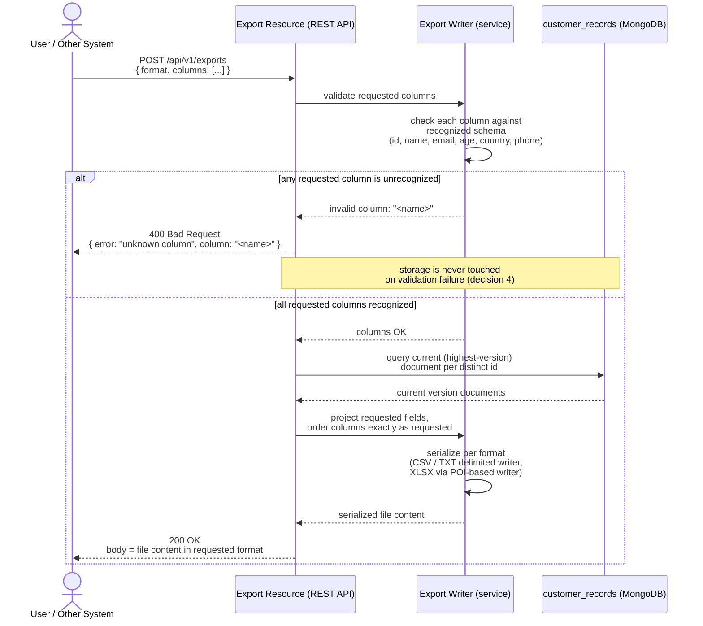

# Sequence Diagram — Export Flow (with Column Validation)

## Diagram

## Context

This sequence diagram traces `POST /api/v1/exports` end to end, following `docs/openspec/changes/file-import-export/design.md`, section 4 ("Export flow"), steps 1-3. Column validation is drawn as the first action, strictly before any read from `customer_records`, to make explicit that an invalid request never touches storage (confirmed decision 4: "on any unrecognized column, return `400` naming it... without touching storage").

Key ordering choices reflected:

- Validation happens against the fixed recognized schema (`id, name, email, age, country, phone`) — the same schema enforced during import (design.md, sections 3-4) — not against whatever fields happen to exist in a particular stored document.
- On success, the query is explicitly for the **current (highest-version) document per distinct `id`** — never a specific historical version — consistent with the "current version" definition in ADR-0001/ADR-0004 (highest `version` number per `id`).
- Column projection and ordering happen after the query, honoring "requested fields, in the requested order" exactly (confirmed decision 4), rather than returning documents in their natural field order.
- Serialization format (CSV/TXT/XLSX) is a final step applied uniformly regardless of which format was requested — the same projected/ordered data feeds all three writers, so format choice does not change validation or query behavior.

## Sources used

- `docs/openspec/changes/file-import-export/design.md`, section 4 (export flow) and section 2 (REST API surface — `/api/v1/exports` request/response shape).
- `docs/requirements/functional-specification.md` — confirmed decisions 4 (unknown column → 400), 6 (XLSX only, no legacy XLS), 16 (current version = highest version per id).
- `docs/adr/ADR-0001-mongodb-embedded-document-per-version-storage.md` — "current version" query semantics (highest version per id).

## ADRs / decisions reflected

- **Confirmed decision 4** — the diagram's `alt` block puts the 400 response and "storage is never touched" note on the failure branch explicitly, and the success branch queries storage only after validation passes.
- **Confirmed decision 6** — the serialization step names XLSX (Office Open XML) as the spreadsheet format; no legacy XLS writer path exists in the diagram.
- **ADR-0001 / confirmed decision 16** — the query step is explicitly "current (highest-version) document per distinct id," not "all versions," matching the document-per-version storage model's defined notion of current state.

## Limitations / notes

- No diagram-validation tooling applies to this repository (no `src/`, no build files yet — see `docs/diagrams/c4/context.md`, Limitations). Mermaid `sequenceDiagram` syntax was validated by manual inspection (matched `alt`/`else`/`end`, valid arrow types, balanced braces inside message text).
- The specific CSV/TXT writer library and the POI-based (or equivalent) XLSX writer are explicitly left as an implementation-time choice in design.md, section 4, step 3 ("library choice is an implementation-time decision... not fixed by this design"); this diagram names POI only as design.md's own illustrative example, not as a binding library choice.
- OAuth2 bearer-token validation on the export call is omitted from this diagram for clarity and is shown separately in `docs/diagrams/sequence/oauth2-token-flow.md`.
