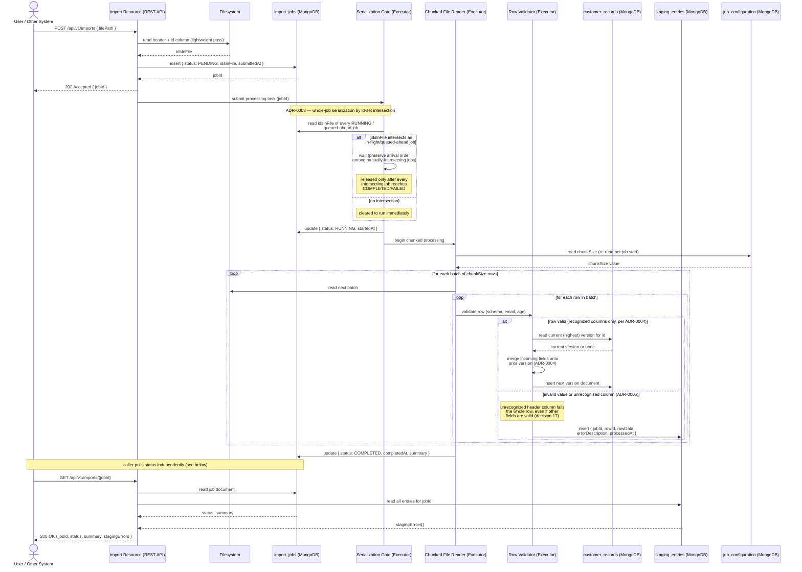

# Sequence Diagram — Asynchronous Import Flow (with ADR-0003 Serialization Gate)

## Diagram

## Context

This sequence diagram traces one import job end to end, following `docs/openspec/changes/file-import-export/design.md`, section 3 ("Import processing flow"), steps 1-7, with the ADR-0003 serialization gate expanded in detail as requested. It deliberately separates the synchronous request (submission, returns `202` immediately) from the asynchronous background processing (executor task) and the independent later status poll, matching confirmed decision 3 ("no synchronous response carrying the error list at import time").

Key ordering choices reflected:

- The `idsInFile` lightweight pass happens **before** the job document is persisted with a `PENDING` status, and **before** the task is submitted to the executor (design.md, section 3, step 1) — this is what makes the id-set available for the ADR-0003 gate check without re-parsing the file inside the executor.
- The Serialization Gate check happens **before** `status` transitions to `RUNNING`, and blocks only on jobs whose `idsInFile` intersects the new job's — disjoint jobs are never delayed (ADR-0003).
- `chunkSize` is read from `job_configuration` fresh at the start of processing, not cached across jobs (design.md, section 3, step 4; ADR-0007).
- Row validation branches into exactly two outcomes per ADR-0004 (versioned merge) and ADR-0005 (generic staging) — there is no third "partial success" path, and an unrecognized header column fails the entire row (confirmed decision 17), not just the offending field.

## Sources used

- `docs/openspec/changes/file-import-export/design.md`, sections 1 (data model), 3 (import processing flow), 6 (concurrency model summary).
- `docs/adr/ADR-0002-async-import-processing-mechanism.md` — executor-based dispatch, no polling/broker.
- `docs/adr/ADR-0003-per-job-id-intersection-serialization.md` — gate mechanics, arrival-order release.
- `docs/adr/ADR-0004-record-versioning-and-merge-policy.md` — merge-onto-prior-version rule.
- `docs/adr/ADR-0005-single-generic-staging-collection.md` — staging entry shape.
- `docs/adr/ADR-0007-job-configuration-value-shape.md` — chunk size re-read per job.
- `docs/requirements/functional-specification.md` — confirmed decisions 3, 10, 13, 14, 17.

## ADRs / decisions reflected

- **ADR-0002** — dispatch is a direct executor submission immediately after job persistence; no scheduler tick or message broker appears anywhere in the flow.
- **ADR-0003** — the gate is drawn as a distinct phase with its own `alt` block, showing both the wait path (intersection) and the immediate-start path (no intersection), and noting arrival-order release explicitly.
- **ADR-0004** — the "row valid" branch always reads the current highest version first, then computes the merge, before inserting — never an in-place update.
- **ADR-0005** — both invalid-value and unknown-column outcomes converge on the same `staging_entries` insert with the same field shape.
- **ADR-0007** — `chunkSize` is fetched from `job_configuration`, not from static application configuration, and fetched once per job start (not per batch), matching design.md's "re-read per job start, not cached indefinitely."

## Limitations / notes

- No diagram-validation tooling applies to this repository (no `src/`, no build files yet — see `docs/diagrams/c4/context.md`, Limitations). Mermaid `sequenceDiagram` syntax was validated by manual inspection (matched `alt`/`else`/`end` and `loop`/`end` blocks, valid arrow types `->>`/`-->>`, no unescaped colons inside message text outside of labels).
- The diagram shows one representative row per branch inside the innermost loop for readability; it does not enumerate every row of the PDF's sample files (that level of worked example belongs in acceptance criteria / test fixtures, not an architecture diagram).
- OAuth2 bearer-token validation on both the submission and status-query calls is omitted from this diagram for clarity and is shown separately in `docs/diagrams/sequence/oauth2-token-flow.md`.
