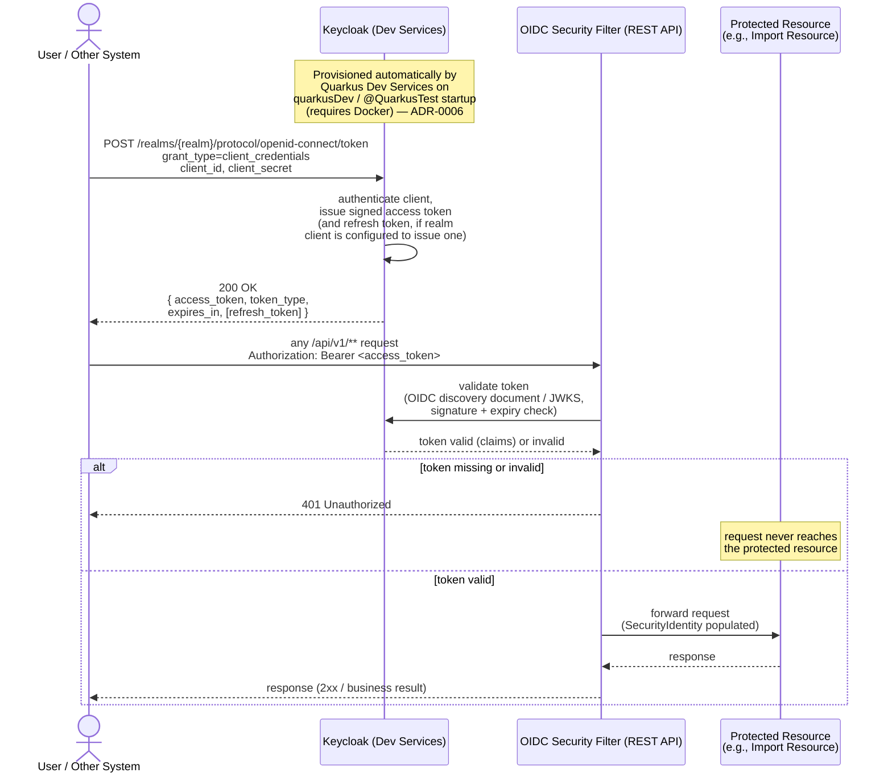

# Sequence Diagram — OAuth2 Client Credentials Token Issuance and Use

## Diagram

## Context

This sequence diagram shows the two logically distinct phases of OAuth2 protection described in ADR-0006: **token issuance**, which the application does not implement at all, and **token validation**, which every `/api/v1/**` endpoint performs as a resource server. It applies uniformly to every protected endpoint in the service (import submission, job-status query, export, and job-configuration CRUD) — the "Protected Resource" participant is a stand-in for whichever endpoint the caller invokes.

Key points reflected:

- The token endpoint (`/realms/{realm}/protocol/openid-connect/token`) belongs to Keycloak, not to this application — design.md, section 5, states explicitly: "No custom token endpoint is implemented by this application (ADR-0006 rules this out explicitly)."
- Keycloak itself is provisioned via Quarkus Dev Services for local/dev/test runs, which is why Docker is a hard dependency for authentication specifically (ADR-0006), even though the database remains infrastructure-free (embedded MongoDB, ADR-0001).
- The refresh token is shown as conditional (`[refresh_token]`) because ADR-0006 documents explicitly that RFC 6749 does not mandate a refresh token for the Client Credentials grant — whether one is issued depends on the Dev-Services-managed realm/client configuration, which is an implementation-time detail, not a structural guarantee.
- The 401 branch shows the request never reaching the protected resource at all — rejection happens entirely at the OIDC Security Filter layer, before any business logic (import, export, job-status, or job-configuration) executes.

## Sources used

- `docs/adr/ADR-0006-oauth2-keycloak-dev-services.md` — token issuance ownership, Dev Services provisioning, Docker dependency, refresh-token caveat.
- `docs/openspec/changes/file-import-export/design.md`, section 5 (authentication integration).
- `docs/requirements/functional-specification.md` — confirmed decision 12 (OAuth2 Client Credentials, ready-made extension requirement).

## ADRs / decisions reflected

- **ADR-0006** — the application is modeled strictly as an OIDC *resource server*; it validates bearer tokens against Keycloak's discovery/JWKS endpoint but never signs or issues a token itself. This is why no "Token Resource" component appears inside the service's own container/component diagrams.
- **Confirmed decision 12** — the grant type shown is exclusively `client_credentials` (machine-to-machine, no end-user login step, no authorization-code/browser redirect flow is modeled).
- **ADR-0006 consequence (refresh token)** — explicitly marked optional/conditional in the diagram rather than guaranteed, reflecting the ADR's own documented uncertainty about the Dev-Services realm's default configuration.

## Limitations / notes

- No diagram-validation tooling applies to this repository (no `src/`, no build files yet — see `docs/diagrams/c4/context.md`, Limitations). Mermaid `sequenceDiagram` syntax was validated by manual inspection (matched `alt`/`else`/`end`, valid arrow types, balanced braces in message text).
- Exact realm/client configuration (client id/secret provisioning, token lifetime, whether refresh tokens are enabled) is left to implementation, per ADR-0006's "More Information" section — this diagram shows the protocol-level interaction, not the Dev-Services realm's specific configuration values.
- This diagram is referenced from, and complements, `docs/diagrams/sequence/import-flow.md` and `docs/diagrams/sequence/export-flow.md`, both of which omit token validation for their own readability and defer to this diagram for that concern.
