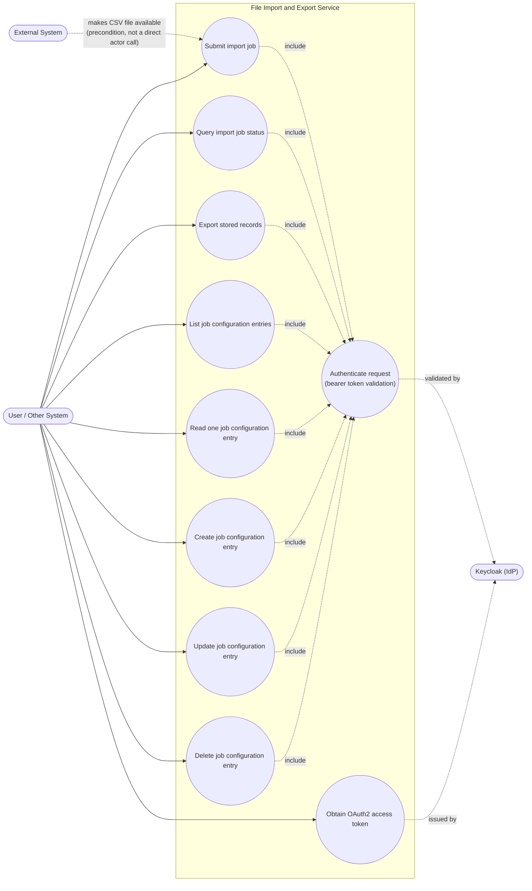

# Use Case Diagram (Flowchart Approximation) — File Import and Export Service

## Diagram

## Context

This diagram inventories every caller-initiated interaction with the File Import and Export Service, derived from the REST API surface in `docs/openspec/changes/file-import-export/design.md`, section 2, and the capability list in `docs/openspec/changes/file-import-export/proposal.md`. Each use case corresponds to exactly one documented endpoint or externally observable capability:

| Use case | Source endpoint / capability |
| --- | --- |
| Submit import job | `POST /api/v1/imports` |
| Query import job status | `GET /api/v1/imports/{jobId}` |
| Export stored records | `POST /api/v1/exports` |
| List / Read / Create / Update / Delete job configuration entry | `GET/GET/POST/PUT/DELETE /api/v1/job-configurations` |
| Obtain OAuth2 access token | Keycloak's `/realms/{realm}/protocol/openid-connect/token` (external to this service, ADR-0006) |
| Authenticate request (bearer token validation) | Cross-cutting `<<include>>` on every protected endpoint (ADR-0006) |

The **External System** actor is shown with a dashed precondition edge into "Submit import job" rather than a direct actor association: per confirmed decision 8, the external system does not call the API itself — it only places a CSV file on a filesystem path that the caller later references when submitting the import job. This distinction is drawn deliberately to avoid implying a direct integration that does not exist.

## Sources used

- `docs/openspec/changes/file-import-export/design.md`, section 2 (REST API surface) and section 5 (authentication integration).
- `docs/openspec/changes/file-import-export/proposal.md` — capability list (import, job-status, export, job-configuration, authentication).
- `docs/requirements/functional-specification.md` — confirmed decisions 3, 8, 9, 11, 12 (async flow, file delivery, job-configuration CRUD, OAuth2).
- `docs/adr/ADR-0006-oauth2-keycloak-dev-services.md` — token issuance ownership (Keycloak, not this service) and resource-server validation.

## ADRs / decisions reflected

- **ADR-0006** — "Obtain OAuth2 access token" is modeled as fulfilled by Keycloak, not by the service itself (no custom token endpoint use case exists inside the system boundary); "Authenticate request" is a cross-cutting `<<include>>` on every other use case, reflecting that all `/api/v1/**` endpoints require a valid bearer token.
- **Confirmed decision 8** — no "Upload file" or "Provide remote URL" use case exists; only a filesystem-path reference is modeled, and the External System's role is reduced to a precondition rather than a use-case-triggering actor.
- **Confirmed decision 11** — job configuration is modeled as five separate use cases (List, Read, Create, Update, Delete) rather than one generic "Manage configuration" use case, to keep traceability to the five distinct HTTP methods/endpoints in design.md's API table.

## Limitations / notes

- **Mermaid has no native UML use-case diagram syntax** (no actor/ellipse/`<<include>>`/`<<extend>>` primitives). This diagram is a documented approximation built from `flowchart LR`, using `(["..."])` stadium shapes for actors and `((...))` circle shapes for use cases, with dashed labeled edges standing in for `<<include>>` relationships. This is an intentional substitution, not an attempt to claim Mermaid supports UML use-case notation natively.
- No diagram-validation tooling applies to this repository (see `docs/diagrams/c4/context.md`, Limitations). Syntax was validated by manual inspection only (balanced brackets/parentheses for each shape type, valid `flowchart` direction keywords, no reserved characters left unescaped in labels).
- Use case granularity follows the REST endpoint table exactly (one use case per endpoint) rather than a more abstract business-goal-level use case set, since the design document itself is expressed at endpoint granularity and no coarser-grained business use case is described in the source material.
